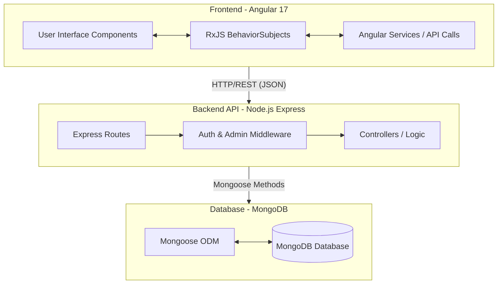
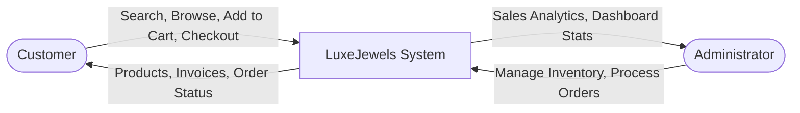
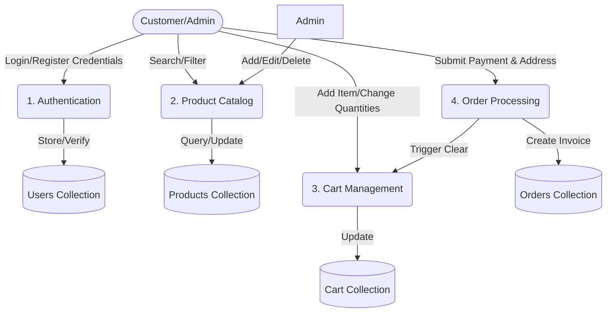
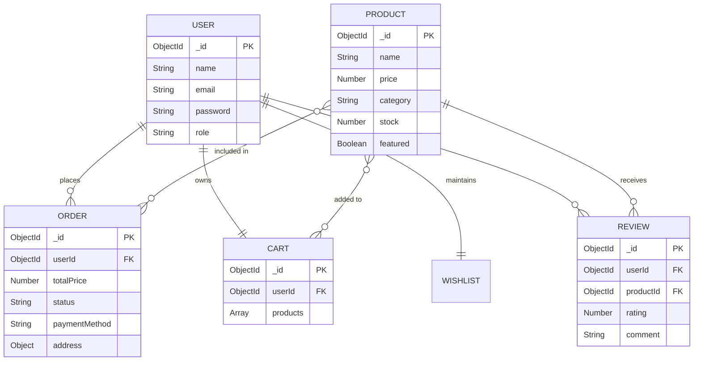
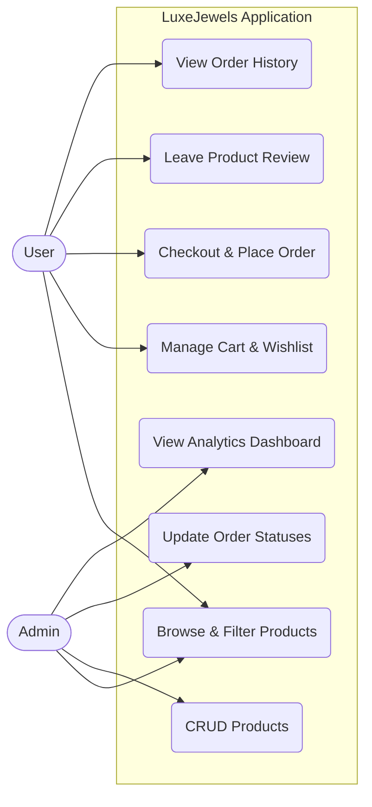
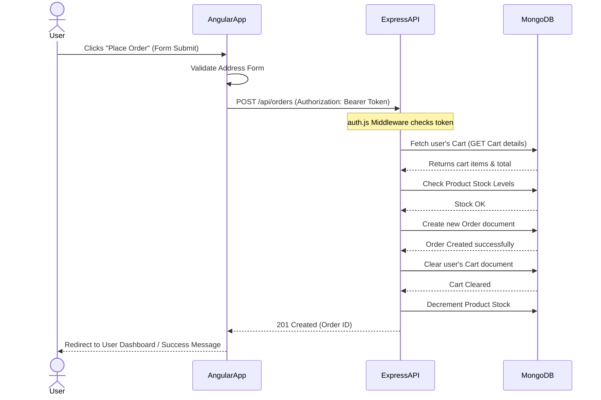
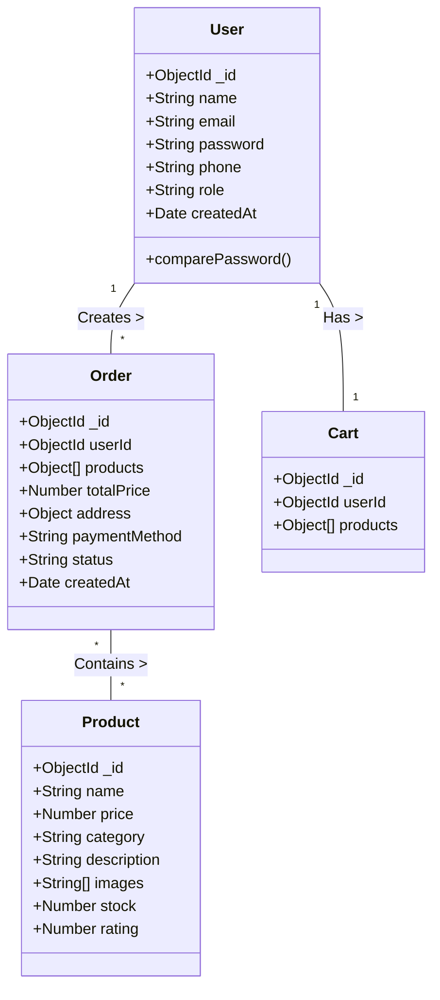

# LuxeJewels: System Design & Architecture Diagrams

This document contains the comprehensive project profile, system design principles, Data Flow Diagrams (DFDs), Entity Relationship (ER) diagrams, and UML diagrams for the LuxeJewels application.

---

## 1. Project Profile & Description

**Project Name**: LuxeJewels
**Project Type**: Premium E-Commerce Web Application
**Domain**: Jewellery Retail
**Target Audience**: Customers looking to buy premium rings, necklaces, earrings, bracelets, and watches online.

### Project Description
LuxeJewels is a full-stack, responsive, and secure e-commerce platform designed to simulate a high-end jewellery shopping experience. It features continuous cart syncing, wishlist management, product reviews, and an administrative quadrant for inventory and order management.

**Core Technology Stack**:
- **Frontend**: Angular 17 (Standalone Components, RxJS, TypeScript)
- **Backend API**: Node.js & Express.js (RESTful architecture)
- **Database**: MongoDB & Mongoose ODM
- **Security**: JWT (JSON Web Tokens) stateless authentication & bcrypt password hashing

---

## 2. System Architecture Design

The system runs on a decoupled client-server architecture where the Angular 17 SPA communicates with the Express.js backend entirely over HTTP REST endpoints.

---

## 3. Data Flow Diagrams (DFD)

### Level 0 DFD (Context Diagram)
A high-level overview showing the system's interactions with its external entities (User and Admin).

### Level 1 DFD
This diagram breaks down the main system into detailed sub-processes.

---

## 4. Entity Relationship (ER) Diagram

Outlines the MongoDB collections and how they logically relate to one another via Mongoose `ObjectId` references.

---

## 5. UML Diagrams

### A. Use Case Diagram
Maps out the system functionalities available to the different actors.

### B. Sequence Diagram: Creating an Order (Checkout Flow)
Visualizes the sequence of logical operations across the stack when a user places an order.

### C. Class Diagram (Backend Domain Models)
A structural representation of the primary Mongoose Schemas used in the backend.

---

## 6. Database Design Summary

* **NoSQL Approach**: The database heavily leverages document embedding (e.g., embedding snapshot product data into the `Order` document securely) rather than strict relational normalization, which is highly efficient for read-heavy operations like e-commerce.
* **Indexes**: 
  * `email` is indexed and unique in the `Users` collection for fast login mechanisms.
  * A powerful `text` index on `name`, `description`, and `category` allows for instantaneous global searching capabilities.
* **Data Integrity**: Enforced strictly at the Mongoose App-Layer using enums (`'Pending', 'Processing', 'Shipped', 'Delivered'`) and required constraints.
